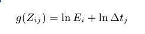
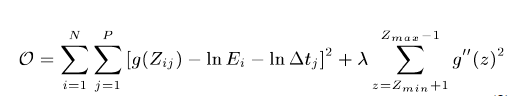

# HDR image processing on gray scale images

Reconstruction of the work of `Debevec, Paul E., and Jitendra Malik. "Recovering high dynamic range radiance maps from photographs." ACM SIGGRAPH 2008 classes. ACM, 2008.`

Basic structure:

* the imaging system response function is defined as:

Where **Z** are *N* sampled pixel values from *P* different photographs and **dt** are the exposure times of the photographs. ln**E** is unknown as well as the function *g*.

We want to minimize this equation in the least squares sense:

Where the last term is a regularizer to make the response curve smooth. Choosing **lambda** properly is essential.

Some weighting function is applied as well while an extra constraint is set for the middle pixel value to have unit exposure.

The output HDR image with **lambda = 3200**:

The algorithm samples *N* pixels from each photograph and does the calculation on the sampled pixels. Here they are choosen randomly but in the paper they sampled the pixels by hand.

For RGB images the process is not straightforward since color balance is not preserved, that's why I got a funny blue table:

It can be seen that the process worked on the level of pixels since everything is well exposed but the colors are messed up.

## @Regards, Alex